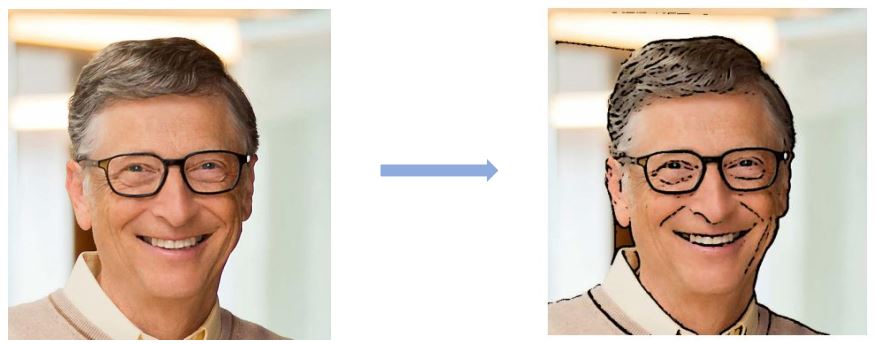

# image_to_cartoon_and_chiaroscuro
This repo contains python code for filtering the image and convert it to cartoon and chiaroscuro format

<h3>image to chiaroscuro</h3>

    

 
<h3>image to catoon (1)</h3>

    

 
<h3>image to cartoon (2)</h3>

    

 
